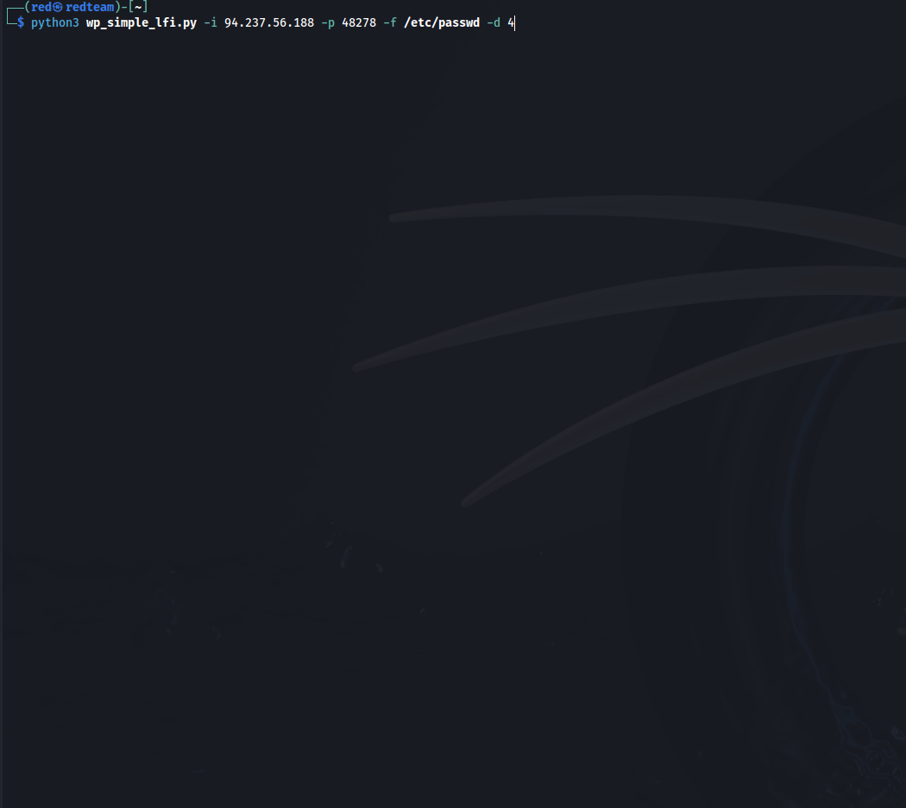
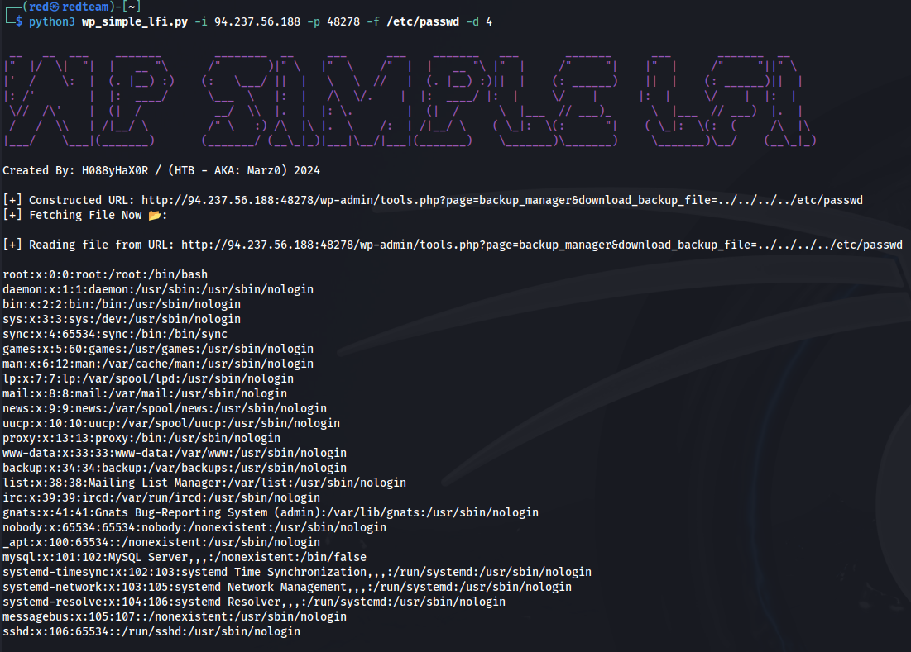

## WordPress Simple Backup 2.7.10/11 File Fetcher
---

## Overview

This Python script is designed to dynamically construct URLs to access (via LFI) the simple-backup plugin files or any other readable files on a WordPress site based on user-provided parameters and fetch content from these URLs. It particularly helps in accessing various depths of backup directories on WordPress sites configured with the backup manager plugin.


## Features

* **Dynamic URL Construction:** Builds URLs to access specific backup files located at various directory depths within a WordPress site.
* **Customizable Parameters:** Allows users to specify the IP address, port, URI, file path, and directory depth to target specific backup file locations.
* **Colored Output:** Utilizes colorama to enhance output readability with colorful and styled terminal text, including a random color banner.
* **Error Handling:** Robust error and exception management to handle HTTP errors and network issues gracefully.

## Prerequisites

To run this script, ensure you have Python 3.x installed along with the following Python packages:

* `requests:` For making HTTP requests.
* `colorama:` For coloring and styling the terminal output.
* `argparse:` For parsing command line arguments.

You can install the required packages using pip:

```bash
pip install requests colorama argparse
```

## Installation

Download the script from the repository, and ensure all dependencies are installed. You can place the script in any directory you choose.

## Usage

Run the script from the command line, providing the necessary parameters:

```bash
python wp_backup_fetcher.py -i <IP_ADDRESS> -p <PORT> -u <URI> -f <FILE_PATH> -d <DEPTH>
```

## Parameters:

* **-i, --ip:** The IP address of the WordPress server.
* **-p, --port:** The port number on which the WordPress server is running (default is 80).
* **-u, --uri:** The URI part after the IP address (default is the root directory '/').
* **-f, --filepath:** The specific file path of the backup file to be fetched.
* **-d, --depth:** The depth parameter to navigate into subdirectories, represented as '../' sequences.

## Example

To fetch a file from a WordPress backup directory:

```bash
python wp_backup_fetcher.py -i 192.168.1.1 -p 8080 -u /wp-content -f backup.zip -d 3
```






## Functionality

The script works as follows:

* **Construct URL:** Combines provided IP, port, URI, file path, and depth into a URL to target specific backup files.
* **Fetch Content:** Makes an HTTP GET request to the constructed URL and displays the content of the file if accessible. It also handles and reports any errors encountered during the request.
* **Display Results:** Outputs the fetched data and some status messages to the terminal, with enhanced readability through colored text.

## Color Output

The script prints a colorful banner and uses random colors for different parts of its output to make it more user-friendly and easier to read. The color changes every time the script is run.
Exiting

You can interrupt the script at any time using Ctrl+C. The script handles this gracefully and will exit with a message indicating that it was interrupted by the user.

---
